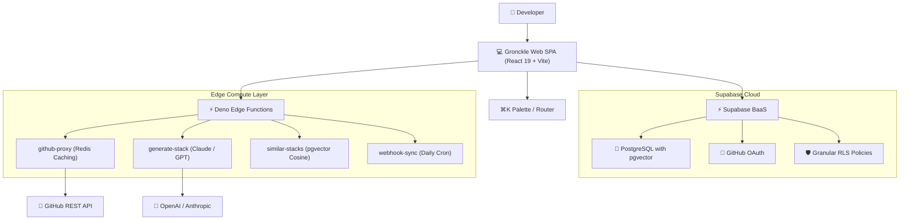

<div align="center">

```
             \                  /
    _________))                ((__________
   /        /)                  (\        \
  /________//   G R O N C K L E  \\________\
 /________//                      \\________\
           \      (o)   (o)      /
            \       \___/       /
             \                 /
```

# GRONCKLE 🐉
### *Hoard the Best. Build the Rest.*

**The dragon's vault of curated developer tools, open-source repositories, and AI-powered stack generation.**

[](https://opensource.org/licenses/MIT)
[](https://www.typescriptlang.org/)
[](https://react.dev/)
[](https://vitejs.dev/)
[](https://supabase.com/)
[](https://github.com/pgvector/pgvector)
[](https://vercel.com/)

[Live App](https://gronckle.dev) • [Documentation](docs/) • [Discord Community](https://discord.gg/gronckle) • [Report a Bug](.github/ISSUE_TEMPLATE/bug_report.md)

</div>

---

## 🌟 Why Gronckle?

Modern developer discovery is noisy: top tools on Hacker News and Twitter often dominate attention while genuinely game-changing, lightweight, and high-performance open-source projects get buried.

**Gronckle** solves this with the personality of an all-knowing dragon who sleeps on a hoard of curated developer repositories. Instead of doom-scrolling, describe your project and let Gronckle smelt your stack in seconds.

---

## 🚀 Key Features

### 1. 🔮 The Smelt (AI Stack Architect)
- **Natural Language Input:** Describe what you are building (e.g., *"A real-time multiplayer whiteboard with end-to-end encryption"*).
- **LLM Reasoning:** Powered by Claude Sonnet & GPT-4o-mini edge functions with verified database matching.
- **Full Stack Breakdown:** Categorized recommendations across Framework, Database, Auth, Storage, and CSS.
- **One-Click Export:** Export your generated architecture as a ready-to-run `package.json` or formatted `README.md`.
- **Vector Search ("Similar Stacks"):** Powered by `pgvector` computing cosine similarities for semantically related tools.

### 2. ⚡ The Stash (Live Repository Vault)
- **Real-Time Stars & Metadata:** Batched GitHub API proxy with Redis and in-memory caching to eliminate rate limits.
- **Single-Click Clone:** Copy terminal clone commands in one click.
- **Community Submissions:** Anyone can submit an underrated repository for review with community upvoting.
- **Crowdsourced Quality Control:** Built-in "Report Outdated" dialog to flag deprecated or broken projects.

### 3. 🛡️ Developer Foundation & Identity
- **Supabase Authentication:** Secure GitHub OAuth login built for developers.
- **User Profiles:** Save custom stacks, manage bookmarks, and track community contributions.
- **Deep Shareable Links:** Unique URLs (`?stack=<id>`) with pre-populated architectures.
- **⌘K Command Palette:** Global keyboard palette (`Ctrl+K` / `Cmd+K`) for lightning-fast tool search and navigation.

### 4. 🎨 Mascot & Micro-Interactions
- **Animated Gronckle Mascot:** Breathing dragon with interactive eye tracking that wakes up on hover.
- **Ember Glow (`#FF6B2B`):** Signature warm fire accents on pure-black background.
- **Interactive Terminal (The Cave):** Built-in retro hacker terminal with contact form and interactive commands (`help`, `discord`, `changelog`, `whoami`, `den`, `smelt`, `stash`, `cave`).

---

## 🏗️ Architecture



---

## 💻 Tech Stack

| Category | Technology |
|---|---|
| **Framework** | [React 19](https://react.dev/) + [TypeScript 5.9](https://www.typescriptlang.org/) |
| **Build Tool** | [Vite 7](https://vitejs.dev/) |
| **Styling** | [Tailwind CSS 3.4](https://tailwindcss.com/) + Custom Ember Orange Theme (`#FF6B2B`) |
| **Motion** | [Framer Motion 12](https://www.framer.com/motion/) + [GSAP 3](https://greensock.com/gsap/) |
| **Components** | [Radix UI](https://www.radix-ui.com/) + [Lucide Icons](https://lucide.dev/) |
| **Backend / DB** | [Supabase](https://supabase.com/) (PostgreSQL 15 + `pgvector`) |
| **Edge Compute** | Deno Edge Functions (Serverless TypeScript) |
| **Caching** | [Upstash Redis](https://upstash.com/) REST API |
| **Telemetry** | Direct ingest PostHog Analytics & Sentry Error Monitoring |
| **Deployment** | Vercel CI/CD via GitHub Actions |

---

## 🛠️ Quickstart

### 1. Clone the repository
```bash
git clone https://github.com/lithish/gronckle.git
cd gronckle
```

### 2. Install dependencies
```bash
npm install
```

### 3. Setup environment variables
```bash
cp .env.example .env
```
Fill in your Supabase project keys in `.env`:
```env
VITE_SUPABASE_URL=https://your-project.supabase.co
VITE_SUPABASE_ANON_KEY=your-anon-key
```

### 4. Run the development server
```bash
npm run dev
```

---

## 📦 Database Migrations & Edge Functions

To deploy the required database schema and Edge Functions:

1. **Apply Migrations:** Run the migration files located in `supabase/migrations/` using Supabase CLI:
   ```bash
   npx supabase db push
   ```
2. **Deploy Edge Functions:**
   ```bash
   npx supabase functions deploy github-proxy --no-verify-jwt
   npx supabase functions deploy generate-stack
   npx supabase functions deploy similar-stacks --no-verify-jwt
   npx supabase functions deploy webhook-sync --no-verify-jwt
   ```

---

## 🤝 Contributing

We welcome contributions! Please review our [Contributing Guide](CONTRIBUTING.md) and [Code of Conduct](CODE_OF_CONDUCT.md) before opening a pull request.

---

## 📜 License

Distributed under the MIT License. See [LICENSE](LICENSE) for more information.

<div align="center">
  <sub>Built with 🔥 and laziness by <a href="https://github.com/lithish">Lithish</a>.</sub>
</div>
